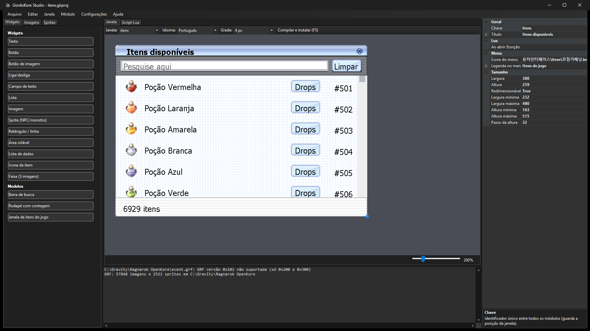
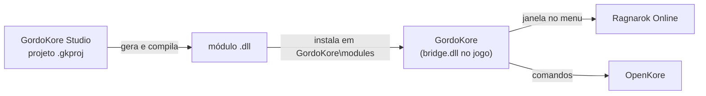
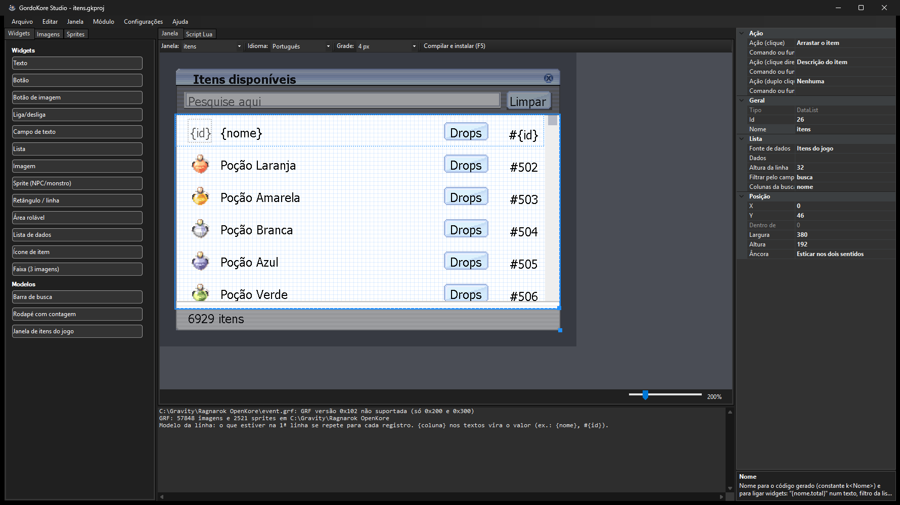
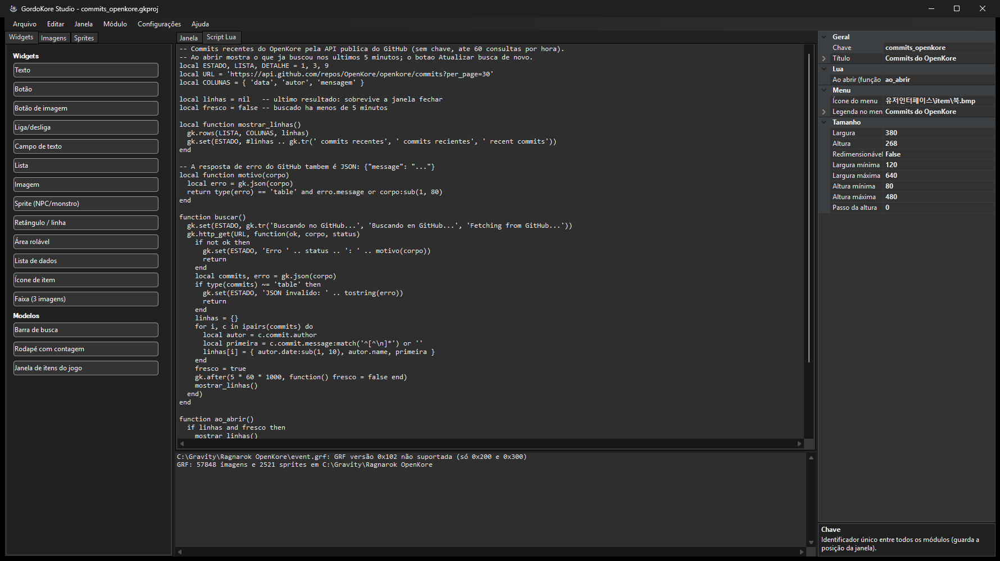
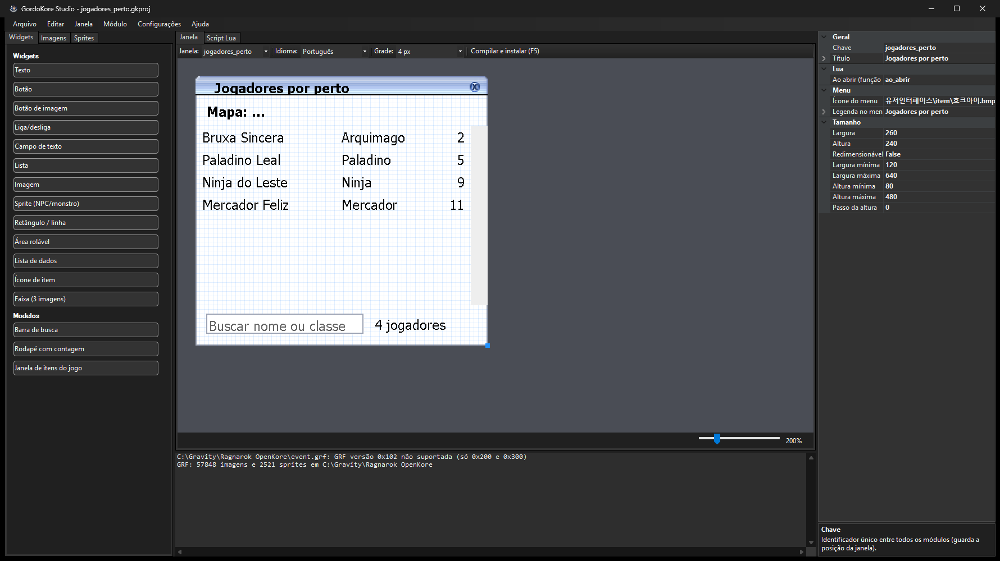
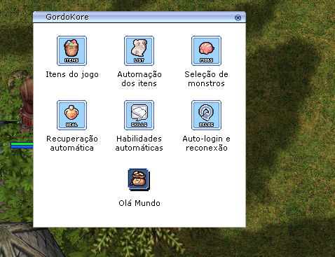

<div align="center">


# GordoKore Studio

**Crie janelas para o Ragnarok Online LATAM sem programar.**
Arraste os widgets, veja a prévia com as texturas do próprio jogo e instale o módulo com um clique.

[](https://github.com/Brunnexo/GordoKore-Studio/releases/latest)
[](https://github.com/Brunnexo/GordoKore-Studio/actions/workflows/build.yml)


[](LICENSE)

[**Baixar**](https://github.com/Brunnexo/GordoKore-Studio/releases/latest) ·
[Primeiros passos](#primeiros-passos) ·
[Manual de Lua](docs/manual-lua.md) ·
[Exemplos](exemplos/)

</div>



## O que é

O **GordoKore Studio** é o editor de módulos do **GordoKore**, o `bridge.dll` que roda dentro do cliente do Ragnarok Online LATAM e conversa com o OpenKore.

Você desenha a janela no estúdio. Ele gera um módulo em C++, compila e instala na pasta do jogo. Quando o jogo abre, a janela aparece no menu do GordoKore, com a aparência das janelas nativas do cliente.



## Recursos

- **Editor visual** com a prévia desenhada com as texturas da GRF do jogo: o que você vê é o que aparece no jogo.
- **Grade e guias de alinhamento**, zoom, desfazer e refazer (Ctrl+Z / Ctrl+Y).
- **Widgets**: texto, botão, botão de imagem, liga/desliga, campo de texto, lista, imagem, sprite de NPC ou monstro, retângulo, área rolável, ícone de item, faixa de 3 imagens.
- **Lista de dados**: linhas repetidas para cada registro, com busca e ações por linha. Os registros podem vir:
  - das tabelas do jogo (itens, monstros, mapas);
  - de quem está no mapa agora (jogadores, NPCs, monstros), atualizados sozinhos;
  - de uma lista fixa;
  - do seu script.
- **Janela redimensionável** com âncoras e **modelos prontos** (barra de busca, rodapé, janela de itens do jogo).
- **Ações sem código**: comando do OpenKore, arrastar item, descrição e drops do item, esconder os outros jogadores, limpar campo.
- **Lua** para dar comportamento às janelas: dados do mapa, timers e internet (buscar numa API e ler JSON).
- **C++** para quem quer ir além, com o SDK do GordoKore.
- Textos em **português, espanhol e inglês**: a janela segue o idioma do jogo.

## Capturas

| Modelo da linha de uma lista | Script Lua |
|---|---|
|  |  |
| **Lista ao vivo dos jogadores do mapa** | **No jogo: o menu do GordoKore** |
|  |  |

## Download e requisitos

Baixe o `GordoKore-Studio-vX.Y.Z-win-x64.zip` na página de [**Releases**](https://github.com/Brunnexo/GordoKore-Studio/releases/latest), descompacte e rode o `GordoKore.Studio.exe`. É um arquivo só e **não precisa instalar o .NET**. O pacote traz também os exemplos e o manual de Lua.

Para usar, você precisa de:

| O quê | Para quê |
|---|---|
| Windows 10 ou 11, 64 bits | Rodar o estúdio. |
| Ragnarok Online **LATAM** instalado | A prévia usa as texturas e sprites da GRF do jogo. |
| **GordoKore** (`bridge.dll`) com **SDK 6** ou mais novo | Carregar os módulos no jogo. É distribuído separadamente. |
| **MinGW-w64 de 32 bits** (`i686-w64-mingw32-g++`) | Compilar os módulos. O caminho padrão é `C:\Strawberry\c\bin`, o MinGW que vem no Strawberry Perl de 32 bits. |
| **CMake** | Montar a compilação. O caminho padrão é `C:\Program Files\CMake\bin\cmake.exe`. |

## Primeiros passos

1. **Configure as pastas.** Em **Configurações**, aponte a **pasta do jogo** (a que tem o `data.grf`) e a **pasta do MinGW**. Elas ficam salvas em `%APPDATA%\GordoKore Studio\settings.json`, junto com o caminho do CMake.
2. **Abra um exemplo**, como **Arquivo > Abrir > `exemplos/painel_bot.gkproj`**, ou crie a sua janela:
   - na aba **Widgets**, clique em **Texto** e em **Botão**;
   - selecione o botão e, na grade à direita, escolha **Ação (clique)** = *Comando do OpenKore* e **Comando ou função** = `ai manual`;
   - selecione a janela (clique no fundo dela) e escolha um **Ícone do menu**, da aba **Imagens** ou um arquivo do PC.
3. **Aperte F5.** O estúdio compila e copia o módulo para `<jogo>\GordoKore\modules`.
4. **Abra (ou reinicie) o jogo.** A janela aparece no menu do GordoKore.

A ajuda completa fica em **Ajuda > Como usar** (F1).

## Exemplos

A pasta [`exemplos/`](exemplos/) tem projetos prontos para abrir, estudar e modificar:

| Projeto | O que mostra |
|---|---|
| [`painel_bot`](exemplos/painel_bot.gkproj) | Botões que mandam comandos ao OpenKore, ações em Lua e em C++. |
| [`itens`](exemplos/itens.gkproj) | A janela "Itens do jogo" refeita só com peças genéricas: busca, lista com ícones, arrastar item, drops. |
| [`jogadores_perto`](exemplos/jogadores_perto.gkproj) | Lista ao vivo dos jogadores do mapa, com busca e distância. |
| [`esconder_jogadores`](exemplos/esconder_jogadores.gkproj) | Um botão que esconde os outros jogadores, só na sua tela. |
| [`commits_openkore`](exemplos/commits_openkore.gkproj) | Busca dados numa API (GitHub) e mostra numa lista do jogo. |

## Scripts Lua

As janelas ganham comportamento com Lua, na aba **Script Lua**:

```lua
local ESTADO = 2

function contar_perto()
  local jogadores = gk.players(10) -- até 10 células
  gk.set(ESTADO, #jogadores .. ' jogadores por perto')
end
```

O [**manual de Lua**](docs/manual-lua.md) ensina do zero, com a referência da API `gk`, receitas prontas e a solução dos erros mais comuns.

## Para desenvolvedores

Para compilar a partir do código, você precisa do **.NET 10 SDK**.

| Comando | O que faz |
|---|---|
| `build.bat` | Compila para uso no dia a dia (`dotnet build -c Release`). |
| `publicar.bat` | Gera a versão de produção: `publish\GordoKore.Studio.exe`, autocontido, arquivo único, sem PDB. |
| `GordoKore.Studio.exe --check` | Verificação: literais C, gerador, validação, exemplos, leitura da GRF e compilação de um módulo de verdade (as duas últimas só com o jogo e o MinGW na máquina). |

Estrutura do repositório:

| Pasta | Conteúdo |
|---|---|
| `src/GordoKore.Studio/` | O estúdio (C#, WinForms). `Grf/` lê o jogo, `Model/` guarda o projeto, `Designer/` desenha a prévia, `Generation/` gera e compila o módulo. |
| `src/GordoKore.Studio/sdk/` | `gordokore_sdk.h`, o contrato com o GordoKore. Vai embutido no estúdio e é copiado para cada módulo gerado. |
| `docs/` | Manual de Lua e imagens. |
| `exemplos/` | Projetos de exemplo. |
| `.github/workflows/` | Verificação a cada push e release automática a cada tag. |

**Releases:** ao enviar uma tag `vX.Y.Z`, o GitHub Actions faz quatro coisas:

1. compila e roda o `--check`;
2. publica o executável autocontido;
3. monta o `.zip` com os exemplos e o manual;
4. cria a release com as notas daquela versão no [`CHANGELOG.md`](CHANGELOG.md).

Quer contribuir? Veja o [`CONTRIBUTING.md`](CONTRIBUTING.md).

## Aviso

Projeto independente e não oficial, sem vínculo com a Gravity. "Ragnarok Online" e as texturas exibidas na prévia pertencem aos seus donos. O estúdio só lê a GRF da sua instalação do jogo e não distribui nenhum arquivo dela. Modificações e automação podem ir contra os termos de uso do jogo: use por sua conta e risco.

## Licença

[MIT](LICENSE) © 2026 Bruno Costa
